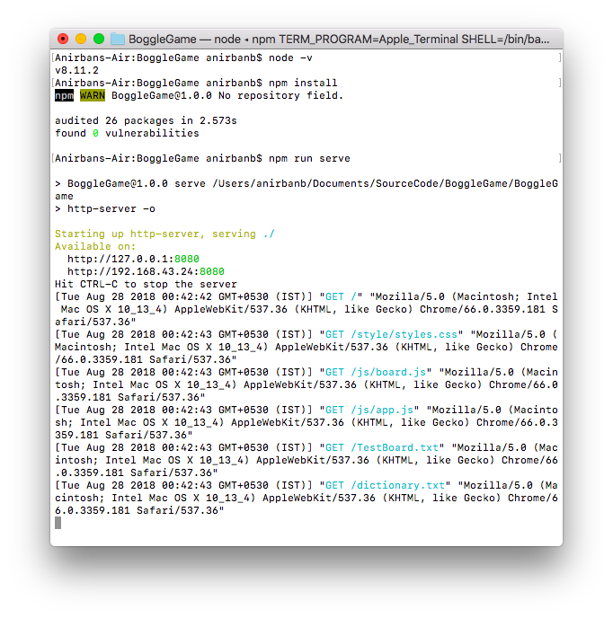
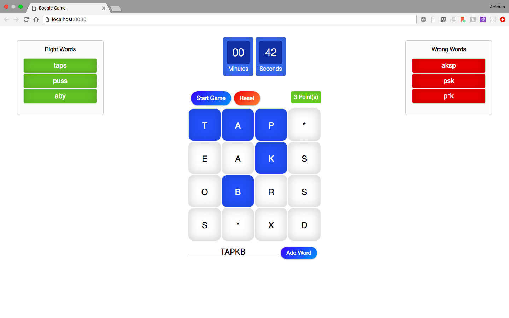

# Boggle Game

A simple Boggle game where users can enter a word or select the 8 adjecent letters of the board to consturct a word. The words are then validated againt the board and dictionary.


## Assumptions and Development

* Only tested in Chrome and Mozilla (Recent Versions).
* Not tested in ie.
* No third party JS library/ Framework has been used (not even Jquey). The Application is written purely in Javascript, HTML and CSS.
* Few configurations like board size, dictionary file path, board configuration file path and the game time can be configured by changing the values of BOGGLE_CONFIG object fields in app.js. Later it can be exposed to user in order to make the game configurable.
* Now you can select a word in board as well as type a word in the textbox.
* Adding the word by pressing RETURN / ENTER key is also introduced for quick addition and improved usability.
* Only alphabet and asterisk (*) are allowed to be entered in textbox.
* Color Condition (Hover over each resulting word to see the meaning of the color) ~
    - If a word is present in board and in dictionary then it will be in 'Right Words' list - having color GREEN
    - If a word is present in board but not in dictionary then it will be in 'Wrong Words' list - having color AMBER 
    - If a word is not present in board the it will be in 'Wrong Words' list - having color RED 

## Prerequisites & Setup

* You need to have [Node](https://nodejs.org) installed in your system.
* A server is required to run the application otherwise the application will not be able to read the static files ( dictionary.txt and TestBoard.txt ). So I have included a command line server - [http-server](https://www.npmjs.com/package/http-server) as a dependency in package.json (ideally it should be devdepedency), which is available as npm package. You can install it globally as well.

## Run

* Open command line (Windows) or terminal (Mac) Navigate to the root directory of the project.
* Run the following

```command line
npm install
```
```command line
npm run serve
```
* This will open a new browser window. If it does not you can hit the url http://127.0.0.1:8080/ or http://localhost:8080/
* Hit ctrl+c to stop the server  
  
Example Run



## Areas of improvement

* Error Handling
* Unit tests
* Converting to ES6
* Minification and Bundling

## Project Structure

```
|_js
| |_app.js
| |_board.js
| |_queue.js
|_style
| |_style.css
|_index.html
|_dictionary.txt
|_TestBoard.txt
|_package.json
```


## Development

I have mainly used ES5 to develop this application (with very little ES6 features which can be supported in all browsers i.e 'let'). However it can be migrated to ES6 with very little effort. I chose not to use ES6 because it might require additional setup for transpilation. For the interest of time I focused less on setup, more on solving the actual problem.

## Thank You